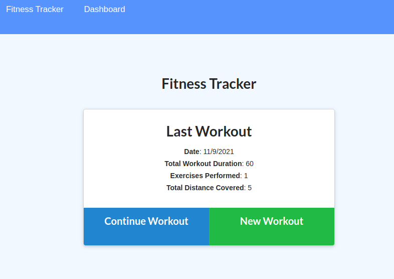
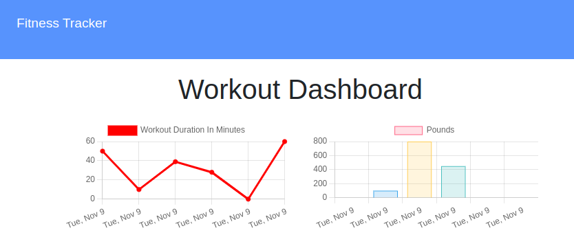

# Workout Tracker

## Table of Contents

* [Description](#description)
* [Screenshot](#screenshot)
* [Installation](#installation)
* [Usage](#usage)
* [License](#license)
* [Questions](#question)

## Description

This is a workout app that allows you to view, create, and track your daily workouts. You can log multiple exercises in a workout on a given day.

## Screenshot

 

 

## Installation

No installation needed! It's live on [Heroku](https://workout-tracker-dlm.herokuapp.com/)!

## Usage

To start a new workout, simple click `New Workout` button on the apps homepage. Then select exercise type and fill in the required options. If want to add more to your workout for the day, click `Add Exercise` and continue adding. Once your done for the day, click `Complete`. Now you can navigate to the `Dashboard` link to see your overall progess broken down into how long your workouts are and how much weight you lift!

## License

MIT

## Questions
Contact me at:
* [GitHub](https://github.com/murda02)
* [Email](mailto:davelmurphy@zoho.com)